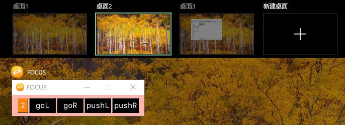

<!-- 2024-10-17(Thu) -->

# ggfocus

一个运行在 windows10/11 上的虚拟桌面管理小工具。

### 功能

操作
- 点击 `goL` 将进入左侧虚拟桌面。
- 点击 `goR` 将进入右侧虚拟桌面。
- 点击 `pushL` 将当前活动应用移动到左侧虚拟桌面。
- 点击 `pushR` 将当前活动应用移动到右侧虚拟桌面。
- 点击 `pushGoL` 将当前活动应用移动到左侧虚拟桌面，同时进入左侧虚拟桌面。
- 点击 `pushGoR` 将当前活动应用移动到右侧虚拟桌面，同时进入右侧虚拟桌面。

其他
- 虚拟桌面的序号采用了不同的颜色进行标记
- 本工具默认置顶显示，可最小化，在所有虚拟桌面都激活

示例，在虚拟桌面1和虚拟桌面2运行

本工具有2个界面可选

### 安装

从`release`下载压缩文件，解压到任意文件夹，双击 `ggfocus.exe` 即可。

应用第一次启动后，“可能”会有一个弹窗提示需要`pysimplegui`的授权码。请您到`pysimplegui`的官网注册一个授权码，并复制粘贴到弹窗中，此后便可以正常使用了。

填写授权码的步骤，在一台机器上只需要一次，故您可能需要填写，也可能您已经在其他应用使用期间填写过从而不需要这一步。

### 赞助

本工具使用了 `pysimplegui` 进行开发，但是我没有购买`pysimplegui`的商业许可证，故您需要自己注册授权码。

如果您感觉本工具对您有帮助，可以考虑赞助 :smile:

